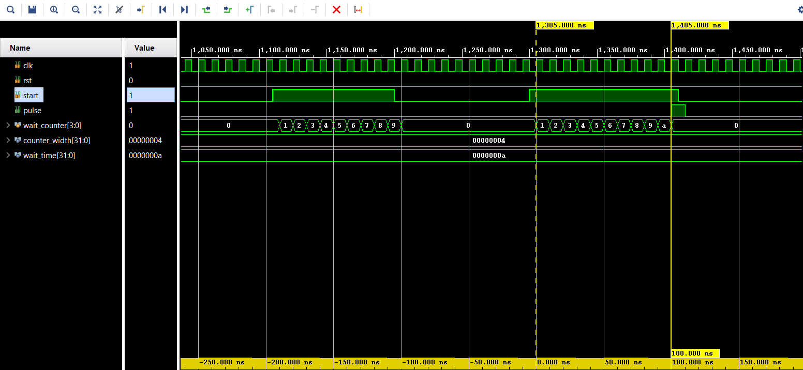

# Parameterizable Digital Event Marker & Pulse Generator

[](https://www.xilinx.com/products/silicon-devices/fpga/artix-7.html)
[](https://www.xilinx.com/products/design-tools/vivado.html)
[-green.svg)](#)
[](#)

A compact, fully parameterizable **Digital Event Marker and Timed Pulse Generator** module written in synthesizable Verilog. The core monitors an incoming trigger/enable line (`start`) and produces a clean, calibrated, single-cycle output pulse (`pulse`) precisely after a programmable delay duration (`wait_time` clock cycles).

It functions simultaneously as a **qualified pulse delay generator**, an **event marker generator**, and a **glitch-rejection / duration-qualification filter** for digital control systems, radar timing controllers, and high-speed communication interfaces.

---

## 📌 Key Highlights & Features

* **Fully Parameterizable Architecture:** Configurable counter bit-width (`counter_width`) and target wait duration (`wait_time`) via top-level module parameters.
* **Glitch & False-Trigger Immunity:** If the `start` input drops before reaching `wait_time`, the counter instantly aborts and resets, ensuring short spurious noise pulses never generate false markers.
* **Deterministic Single-Cycle Output:** Guarantees an exact 1-clock-cycle pulse assertion (`pulse = 1'b1`) on the target cycle.
* **Synchronous & Portable:** Fully synchronous design with active-high reset, compatible with all FPGA architectures (AMD/Xilinx Artix-7, Kintex-7, UltraScale+, Intel Cyclone/Stratix, Lattice).
* **Minimal Hardware Footprint:** Requires only a single counter register and minimal LUT logic, achieving very high maximum clock frequencies ($F_{\text{max}} > 400\text{ MHz}$).

---

## 🎯 Practical FPGA & Embedded Applications

| Application Domain | Practical Role |
|:---|:---|
| **Radar & RF Systems** | Generating delayed sampling triggers, pulse-repetition-frequency (PRF) markers, or range-gate strobes following a transmission burst. |
| **Digital Communications** | Packet delimiter framing, post-preamble sync strobe generation, and serialized word boundaries. |
| **Signal Debouncing / Qualification** | Filtering out glitch transients on asynchronous input lines by requiring a minimum continuous asserted duration before signaling valid events. |
| **FSM State Sequencers** | Generating timed transition strobes between sequential states without stalling processor pipelines. |

---

## 🏗️ Architecture & Operational Logic

```
                    +---------------------------------------------------+
                    |                   event_marker                    |
                    |                                                   |
      clk --------->|> Clock                                            |
      rst --------->|  Synchronous Reset                                |
                    |                                                   |
                    |           +-----------------------+               |
                    |           |  wait_counter (N-bit) |               |
                    |           +-----------------------+               |
                    |                       |                           |
                    |           +-----------v-----------+               |
    start --------->|---------->| Comparator & Sequencer|-------------->| pulse
 (Trigger/Enable)   |           | (wait_counter == wait)| (1-cycle      | (Event Marker)
                    |           +-----------------------+   strobe)     |
                    +---------------------------------------------------+
```

### Behavioral Operation

1. **Reset State (`rst = 1`):** `wait_counter` resets to `0`, and `pulse` is forced to `0`.
2. **Idle State (`start = 0`):** `wait_counter` stays cleared at `0`, and `pulse` remains `0`.
3. **Timing Active (`start = 1`):**
   * While `wait_counter < wait_time`: `wait_counter` increments by `1` each clock edge, `pulse` remains `0`.
   * When `wait_counter == wait_time`: `pulse` asserts high for exactly **1 clock cycle**, and `wait_counter` rolls over to `0`.
4. **Early Release (`start` deasserted before timeout):** If `start` transitions to `0` prior to reaching `wait_time`, the counter immediately clears back to `0`, preventing incomplete triggers from causing false events.

---

## 📐 Parameters & Port Interface

### Module Parameters

| Parameter | Type | Default Value | Description |
|:---|:---:|:---:|:---|
| `counter_width` | Integer | `4` | Bit-width of the internal wait timer register (must satisfy $2^{\text{counter\_width}} > \text{wait\_time}$). |
| `wait_time` | Integer | `10` | Number of clock cycles the `start` signal must be continuously held high before firing `pulse`. |

### Port List

| Port Name | Direction | Width | Polarity | Description |
|:---|:---:|:---:|:---:|:---|
| `clk` | Input | 1-bit | Rising Edge | System clock input (tested at 100 MHz). |
| `rst` | Input | 1-bit | Active-High | Synchronous system reset. Resets internal counter and clears pulse. |
| `start` | Input | 1-bit | Active-High | Event trigger / duration qualification enable input. |
| `pulse` | Output | 1-bit | Active-High | Calibrated single-cycle output event marker pulse. |

---

## 🔬 Simulation & Verification Results

The design was fully verified using **AMD Vivado Simulator (`xsim`)** with a 100 MHz clock ($T_{\text{clk}} = 10\text{ ns}$).



### Key Waveform Observations:
1. **Under-Duration Negative Test ($1110\text{ ns} - 1200\text{ ns}$):**
   * `start` is asserted for only $90\text{ ns}$ (9 clock cycles).
   * Because $9 < 10$, the counter aborts at `9` when `start` falls, and `pulse` **remains 0** (proves robust noise rejection).
2. **Qualified Event Positive Test ($1305\text{ ns} - 1405\text{ ns}$):**
   * `start` is asserted continuously for $110\text{ ns}$.
   * At exactly **$100.000\text{ ns}$** (10 clock cycles after `start` assertion), `pulse` transitions high for exactly **$10\text{ ns}$** (1 master clock cycle).

*(For a comprehensive walkthrough of the simulation and timing analysis, see [`02_RESULTS/README.md`](02_RESULTS/README.md)).*

---

## 📂 Repository Structure

```text
Event_Marker/
├── README.md                      # Top-level showcase and documentation (this file)
├── .gitignore                     # Git ignore rules for AMD Vivado build artifacts
├── LICENSE                        # MIT Open-Source License
│
├── 00_RTL/                        # Synthesizable RTL Design
│   ├── event_marker.v             # Verilog RTL source code
│   └── README.md                  # Detailed RTL architecture & design notes
│
├── 01_Testbench/                  # Verification Environment
│   ├── tb_event_marker.v          # Self-testing Verilog simulation testbench
│   └── README.md                  # Testbench methodology and test scenarios
│
└── 02_RESULTS/                    # Waveforms & Timing Analysis
    ├── event_marker_result.png    # Vivado timing simulation capture
    └── README.md                  # Waveform breakdown and timing verification report
```

---

## 💻 Instantiation Template

```verilog
// Example: Generate an event marker pulse 50 clock cycles after trigger
event_marker #(
    .counter_width (6),   // 6 bits allows up to 63 cycles
    .wait_time     (50)   // 50 clock cycles delay
) u_marker_50cyc (
    .clk   (sys_clk),
    .rst   (sys_rst),
    .start (event_trigger),
    .pulse (delayed_marker)
);
```

---

## ⚙️ How to Build and Simulate in AMD Vivado

1. **Launch Vivado** (v2023.2 or later).
2. Create a new RTL project targeting **Artix-7** (e.g., `xc7a35tcsg324-1` or any target FPGA).
3. Add `00_RTL/event_marker.v` as a **Design Source**.
4. Add `01_Testbench/tb_event_marker.v` as a **Simulation Source**.
5. Click **Run Simulation $\rightarrow$ Run Behavioral Simulation**.
6. Set the simulation run time to at least `2 us` (`run 2us;`).

---

## 👤 Author

**K Sree Sai Venkat**  
FPGA & RTL Design Engineer  
Specialization: Digital Signal Processing (DSP) & High-Speed FPGA Architectures  

---

## 📄 License

This project is licensed under the [MIT License](LICENSE).
